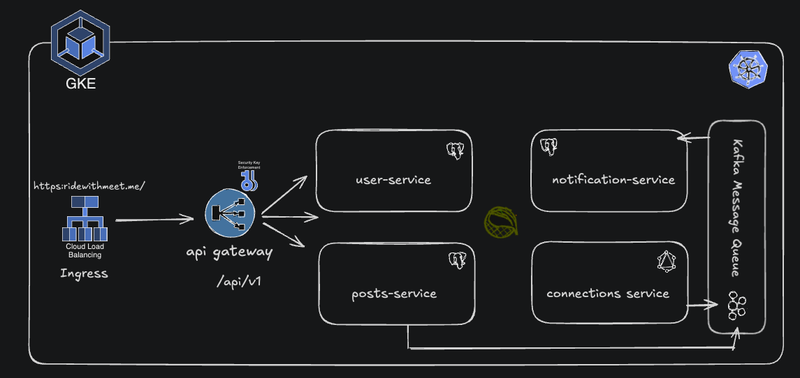

## LinkedInApp-Working – Distributed, Event-Driven LinkedIn-like Platform

A production-style, microservices-based social network backend inspired by LinkedIn. It demonstrates API Gateway + service discovery, secure JWT auth, Kafka-based eventing, polyglot persistence (PostgreSQL + Neo4j), Kubernetes (GKE) with HTTPS via Ingress/TLS, and end-to-end communication flows.

### Key Features
- **API Gateway** with JWT auth and header propagation (`X-User-Id`)
- **Service Discovery** (Eureka) and **OpenFeign** inter-service clients
- **Event-driven** architecture with **Apache Kafka** (posts, likes, connections, and user lifecycle events)
- **Polyglot persistence**: PostgreSQL (users, posts, notifications) and Neo4j (connections graph)
- **Kubernetes** (Deployments, StatefulSets, Services, Ingress) and **GKE** integration
- **TLS/HTTPS** via GKE Ingress (ManagedCertificate or TLS secret)

---

## Tech Stack
- **Language/Build**: Java, Spring Boot, Spring Cloud, Maven
- **Gateway & Discovery**: Spring Cloud Gateway, Eureka
- **Inter-service**: OpenFeign, REST
- **Messaging**: Apache Kafka (+ Kafka UI)
- **Databases**: PostgreSQL (user, posts, notification), Neo4j (connections)
- **Containers/Orchestration**: Docker, Docker Compose, Kubernetes (GKE)
- **Security**: JWT (HMAC) with Gateway auth filter

## Microservices
- `api-gateway`: Single entrypoint, JWT validation, path routing, `X-User-Id` injection
- `discovery-server`: Eureka registry
- `user-service`: Signup/Login, emits `user-created-topic`
- `posts-service`: Create posts, like/unlike posts, emits `post-created-topic`, `post-liked-topic`
- `connections-service`: First-degree connections, send/accept/reject connection requests, emits connection request topics; consumes `user-created-topic`
- `notification-service`: Consumes post and connection events, sends notification records; calls `connections-service` via Feign

## Databases
- `user-db` (PostgreSQL): users
- `posts-db` (PostgreSQL): posts, likes
- `notification-db` (PostgreSQL): notifications
- `connections-db` (Neo4j): people graph + edges (connections, requests)

---



---

## API Gateway Routes
Gateway base path and filters are configured in `api-gateway/src/main/resources/application.yml`.
- Base host: `https://ridewithmeet.me` (via Ingress)
- Routes:
  - `user-service`: `/api/v1/users/**` → forwarded to service (StripPrefix=2)
  - `posts-service`: `/api/v1/posts/**` → requires `Authorization: Bearer <JWT>`
  - `connections-service`: `/api/v1/connections/**` → requires `Authorization: Bearer <JWT>`
  - `notification-service`: `/api/v1/notification/**` → requires `Authorization: Bearer <JWT>`

### User Service (public)
- `POST /api/v1/users/auth/signup`
- `POST /api/v1/users/auth/login` → returns JWT (string)

### Posts Service (requires JWT)
- `POST /api/v1/posts/core` → create post
- `GET /api/v1/posts/core/{postId}` → get post
- `GET /api/v1/posts/core/user/{userId}/allPosts` → posts by user
- `POST /api/v1/posts/likes/{postId}` → like post
- `DELETE /api/v1/posts/likes/{postId}` → unlike post

### Connections Service (requires JWT)
- `GET /api/v1/connections/core/first-degree`
- `POST /api/v1/connections/core/request/{userId}`
- `POST /api/v1/connections/core/accept/{userId}`
- `POST /api/v1/connections/core/reject/{userId}`

### Notes
- On authenticated routes, the Gateway validates the JWT and injects `X-User-Id` header with the token subject. Downstream services use interceptors to read it.

### Curl examples
```bash
# Signup
curl -X POST https://ridewithmeet.me/api/v1/users/auth/signup \
  -H 'Content-Type: application/json' \
  -d '{"name":"Alice","email":"alice@example.com","password":"secret"}'

# Login (get JWT)
TOKEN=$(curl -s -X POST https://ridewithmeet.me/api/v1/users/auth/login \
  -H 'Content-Type: application/json' \
  -d '{"email":"alice@example.com","password":"secret"}')

# Create a post
curl -X POST https://ridewithmeet.me/api/v1/posts/core \
  -H "Authorization: Bearer ${TOKEN}" \
  -H 'Content-Type: application/json' \
  -d '{"content":"Hello World"}'
```

---

## Kafka Communications
Topics are created via Spring Kafka Admin in each service.

- `user-created-topic`
  - Producer: `user-service`
  - Consumers: `connections-service` (creates Person node in Neo4j)

- `send-connection-request-topic`
  - Producer: `connections-service`
  - Consumers: `notification-service` (notify receiver)

- `accept-connection-request-topic`
  - Producer: `connections-service`
  - Consumers: `notification-service` (notify sender)

- `post-created-topic`
  - Producer: `posts-service`
  - Consumers: `notification-service` (notify first-degree connections via Feign to `connections-service`)

- `post-liked-topic`
  - Producer: `posts-service`
  - Consumers: `notification-service` (notify post creator)

Kafka bootstrap server (in-cluster): `kafka:9092`

Kafka UI (K8s): exposed at `/kafka-ui` via Ingress.

---

## Running Locally (Docker Compose)
A simplified local stack is provided in `docker-compose.yml`.

```bash
# Start all services, DBs, Kafka + UI, Gateway, Discovery
docker compose up -d

# Access
- API Gateway: http://localhost:8080
- Eureka:      http://localhost:8761
- Kafka UI:    http://localhost:8090
```

Images are referenced as `meet16123/linkedin-app:<service>`. You can rebuild and retag to your Docker Hub (or use local image names) if needed.

---

## Kubernetes (GKE) Deployment
Manifests live under `k8s/deployments/` and cover:
- Deployments: `api-gateway`, `posts-service`, `connections-service`, `notification-service`, `user-service`
- StatefulSets: `user-db`, `posts-db`, `notification-db`, `connections-db`, `kafka`
- Services: ClusterIP headless DB services, service per app, `kafka-ui-service`
- Ingress: `ingress.yaml` routes `ridewithmeet.me` → `api-gateway` and `/kafka-ui` → Kafka UI
- TLS: Either ManagedCertificate (GKE) or a pre-created secret named `tls-secret`

### Prerequisites
- GKE cluster and `kubectl` context set
- Container images pushed to a registry accessible by GKE (or use Artifact Registry/GCR)
- DNS A record for `ridewithmeet.me` → GCLB IP created by Ingress

### Apply manifests (example)
```bash
# Namespace (optional)
kubectl create namespace linkedin || true

# Datastores
kubectl apply -n linkedin -f k8s/deployments/user-db.yaml
kubectl apply -n linkedin -f k8s/deployments/posts-db.yaml
kubectl apply -n linkedin -f k8s/deployments/notification-db.yaml
kubectl apply -n linkedin -f k8s/deployments/connections-db.yaml

# Kafka and Kafka UI
kubectl apply -n linkedin -f k8s/deployments/kafka.yaml
kubectl apply -n linkedin -f k8s/deployments/kafkaui.yaml

# Core services
kubectl apply -n linkedin -f k8s/deployments/user-service.yaml
kubectl apply -n linkedin -f k8s/deployments/posts-service.yaml
kubectl apply -n linkedin -f k8s/deployments/connections-service.yaml
kubectl apply -n linkedin -f k8s/deployments/notification-service.yaml
kubectl apply -n linkedin -f k8s/deployments/api-gateway.yaml

# TLS/Ingress
# Option A: ManagedCertificate (GKE will provision a cert)
kubectl apply -n linkedin -f k8s/deployments/managed-cert.yaml
# Then annotate Ingress to use it (update ingress.yaml):
# metadata.annotations["networking.gke.io/managed-certificates"]: ridewithmeet-cert

# Option B: Use an existing cert as secret `tls-secret`
# kubectl create secret tls tls-secret \
#   --cert=fullchain.pem --key=privkey.pem -n linkedin

kubectl apply -n linkedin -f k8s/deployments/ingress.yaml
```

### Ingress and TLS
- `ingress.yaml` uses class `gce`, exposes:
  - `/` → `api-gateway:80`
  - `/kafka-ui` → `kafka-ui-service:8080`
- TLS:
  - If using a secret: ensure `secretName: tls-secret` exists in the same namespace
  - If using GKE ManagedCertificate: add the `networking.gke.io/managed-certificates` annotation and remove `secretName`

### Configuration Notes
- Services read DB connection and peer service URIs via env vars (see `*-service.yaml`).
- Gateway reads upstream URIs from env (`USER_SERVICE_URI`, `POSTS_SERVICE_URI`, `CONNECTIONS_SERVICE_URI`, `NOTIFICATION_SERVICE_URI`).
- Health probes: Gateway exposes `/actuator/health` as readiness.

---

## Security
- JWT is validated at the Gateway (`AuthenticationFilter`), which rejects missing/invalid tokens.
- On success, Gateway injects `X-User-Id` header downstream.
- Use `Authorization: Bearer <token>` on all non-auth routes.

---

## Environment Matrix
- Local (Compose)
  - Gateway: `http://localhost:8080`
  - Kafka UI: `http://localhost:8090`
- Kubernetes (GKE)
  - Gateway: `https://ridewithmeet.me`
  - Kafka UI: `https://ridewithmeet.me/kafka-ui`

---

## Repository Structure (selected)
- `api-gateway/` – Spring Cloud Gateway, JWT filter
- `discovery-server/` – Eureka Server
- `user-service/`, `posts-service/`, `connections-service/`, `notification-service/`
- `k8s/deployments/` – K8s manifests (Deployments, StatefulSets, Services, Ingress, TLS/ManagedCertificate)
- `docker-compose.yml` – Local stack

---

## Troubleshooting
- 401 on protected routes: ensure `Authorization: Bearer <token>` is present and valid
- 5xx on posts/connections: verify Kafka is reachable (`kafka:9092`) and DBs are up
- Ingress not issuing HTTPS:
  - ManagedCertificate: domain must resolve to the Ingress IP and cert status must be Active
  - TLS secret: ensure the secret name matches `tls-secret` and certificates are valid
- Neo4j memory: adjust `connections-db.yaml` resource limits if OOM/restarts

---
